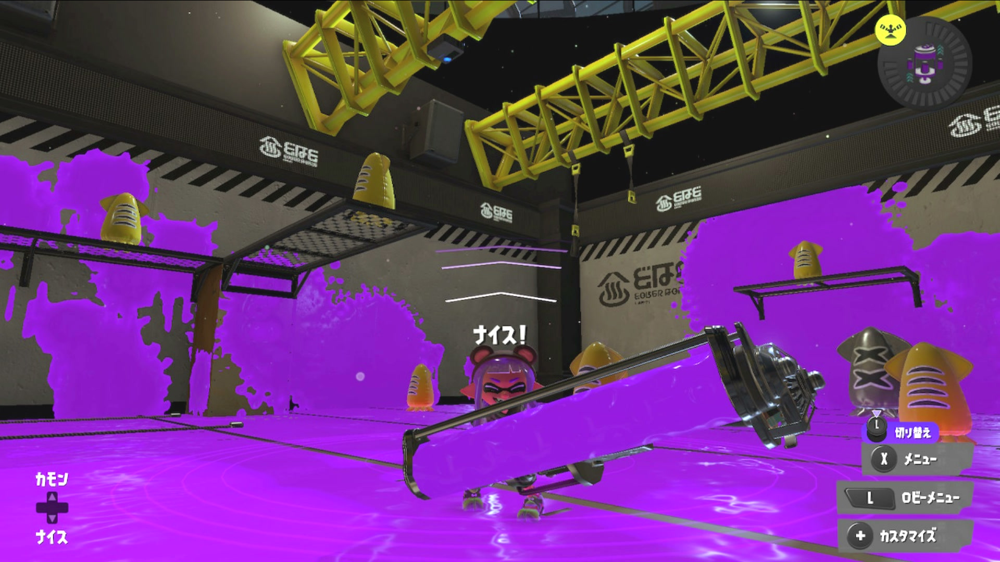

# HD60 S Linux Driver

[](LICENSE)
[]()
[]()
[]()

**Elgato HD60 S (HDMI キャプチャカード) を Linux で動作させる**、USB プロトコル・レジスタマップ・MCU シーケンスを逆解析して作った ユーザーランドドライバ。純正ドライバは Windows / macOS のみ、それ以前の Linux 実装も存在しなかった (Doug Brown が 2024/09 に "no Linux drivers exist" と明言) ため、実質的に **公開されている唯一の HD60 S Linux 実装** です (2026-07 時点、私達の把握範囲で)。

`English version follows below.`



*iso_capture が `/dev/video42` に流し込んだ映像 (1080p60 YUYV、Splatoon 3 ロビー画面)*

---

## 何ができる

`./hd60s live` 一発で:

- ✅ **1080p60 YUYV 映像キャプチャ** → `/dev/video42` (v4l2loopback) → OBS Studio / mpv / ffmpeg などから利用
- ✅ **96kHz mono 音声キャプチャ** → PipeWire ノード `hd60s-monitor` → OBS / スピーカー
- ✅ **HDMI パススルー** (HD60 S HDMI OUT → TV) を並行して 低遅延で維持 (ゲームプレイに使える)
- ✅ **iso capture と パススルー 同時動作** (Windows Elgato Game Capture ソフトと同じ運用パターンが可能)

Nintendo Switch を接続して 動作確認済み。長時間プレイでも安定 (iso packet loss ~5-7%)。

## Windows Elgato Game Capture ソフトとの比較

| 機能 | Windows 純正 | Linux (このドライバ) |
|-----|------------|-----------------|
| 1080p60 映像キャプチャ | ✅ | ✅ |
| 音声キャプチャ | ✅ 48kHz | ✅ 96kHz mono (SEP-native) |
| HDMI パススルー (TV 出力) | ✅ | ✅ |
| iso capture と パススルー同時 | ✅ | ✅ |
| OBS Studio 連携 | ✅ | ✅ (V4L2 + PipeWire ネイティブ) |
| モニタリング遅延 | ~15-20ms | ~20-30ms |

---

## 免責 (Disclaimer)

⚠️ **このソフトウェアは非公式実装です**。Elgato Systems GmbH とは無関係、同社の承認を受けていません。逆解析は プロトコル互換性目的 (interoperability) で行なわれており、一般に interoperability 目的の逆解析は多くの管轄で適法と考えられていますが、これは法的助言ではありません。使用に伴う法的判断は各自の管轄下でお願いします。

本ドライバの使用によって発生した機器破損・データ損失・その他の損害について、作者は一切の責任を負いません。動作は無保証 (as-is)、使用は自己責任でお願いします。

---

## 動作環境

- **OS**: Ubuntu 25.04 以降 (kernel 7.0系, PipeWire 1.6+ 想定)
- **USB**: **USB 3.0 (SuperSpeed) 必須**。1080p60 は 2Gbps 出るので USB 2.0 だと帯域が足りない
- **音声**: **PipeWire** (PulseAudio only 環境では動作しない、PulseAudio → PipeWire 移行済み想定)
- **v4l2loopback**: 0.15.3 以降 推奨 (`exclusive_caps=0` で運用)
- **対象デバイス**: Elgato Game Capture HD60 S (VID `0fd9` / PID `0074`) — **HD60 S+ は別チップ構成なので動かない**

### 既知の制約 / TODO

- Ubuntu 25.04 以外は未検証 (他ディストロ / 他バージョンでは要調整の可能性)
- Wayland + NVIDIA GPU 環境で mpv `--vo=gpu-next` が MESA ZINK エラーで動かない場合あり → `--vo=wlshm` を強制 (wrapper で対応済)
- 30fps / 720p60 モードは未実装 (1080p60 のみ動作確認)
- HD60 S+ / HD60 X などの後継モデルは非対応
- ホットプラグは非対応 (起動時に接続してる前提)

---

## Build

```bash
# 依存パッケージ
sudo apt install \
  build-essential \
  libusb-1.0-0-dev \
  libasound2-dev \
  libpipewire-0.3-dev \
  v4l2loopback-dkms \
  alsa-utils \
  tmux mpv ffmpeg

# ビルド
make iso_capture
```

---

## 使い方

### 一発起動 (推奨)

```bash
./hd60s live
```

これで tmux セッションが立ち上がる:

- **上ペイン**: `iso_capture` — USB 制御、映像/音声抽出、PipeWire ノード公開
- **下ペイン**: `mpv` — 13 秒後に自動で `/dev/video42` を再生

**同時に TV には HDMI パススルー経由でゲーム映像が低遅延で出る** (プレイに使う経路)。

操作:
- `Ctrl+B → 矢印` : ペイン切替
- `Ctrl+B → d` : デタッチ (バックグラウンド継続)
- `Ctrl+B → q` : 全終了

### OBS Studio で使う

1. 上記 `./hd60s live` で iso_capture を起動しておく (mpv は不要なら閉じてよい)
2. OBS ソース追加:
   - **映像キャプチャデバイス (V4L2)** → デバイス: `/dev/video42`
   - **音声入力キャプチャ (PulseAudio/PipeWire)** → デバイス: `hd60s-monitor`
3. Windows OBS と同じ感覚で録画/配信できる

「音声モニタリング: モニターのみ (出力はミュート)」設定にすれば、プレイ音は PC スピーカーで即時モニタ、録画音は同期して録画される (Windows OBS と同じ挙動)。

---

## アーキテクチャ

```
      ┌───────────────┐
      │  Switch etc.  │
      └───────┬───────┘
              ▼
   ┌──────────────────────┐         ┌──────────────┐
   │  Elgato HD60 S       │──HDMI──▶│  TV           │
   │                      │   OUT   │  (passthrough)│
   │  IT6802E HDMI RX     │         │  低遅延        │
   │       ↓              │         └──────────────┘
   │  Nuvoton M031 MCU    │
   │       ↓              │
   │  Altera MAX II CPLD  │
   │       ↓              │
   │  Cypress FX3 USB     │
   │  ── iso EP 0x83 ─────┼──────▶ Linux Host
   │                      │
   │  IT66121 HDMI TX ────┼──▶ (passthrough)
   └──────────────────────┘
              │
              ▼ USB 3.0
   ┌──────────────────────┐
   │  iso_capture (libusb)│
   │  - Init + MCU/CPLD   │
   │  - Frame parser      │
   │  - PipeWire stream   │
   └───┬──────────────┬───┘
       │              │
       ▼              ▼
  /dev/video42    PipeWire node
  (v4l2loopback)   "hd60s-monitor"
       │              │
       ▼              ▼
    OBS / mpv     OBS / speakers
```

---

## 開発体制について (AI 運用)

このプロジェクトは私 (kusq) が主導しつつ、Anthropic の Claude を伴走ツールとして活用して完成させた リバースエンジニアリングプロジェクトです。**Windows/macOS 純正しか存在しないハードウェアに対して 数日で Linux 実装が生まれた** のは、AI との協働ワークフローの効果が大きく、今後同様の RE プロジェクトの参考事例になればと思って明記します。

### 役割分担

- **私 (人間)**: 方針判断、実機テスト、優先度決定、USB pcap の物理取得、動作確認と体感評価
- **Claude Opus 4.7** (メインエージェント / 主に相談する相手): 実装コード生成、日々の相談、コードレビュー、Web 検索、Telegram 経由でのやりとり
- **Claude Opus 4.8** (サブエージェント / 静的解析用): 大規模な pcap / firmware の静的解析、実装方針の戦略相談、詰まった時の高度な推論
- **Claude Fable 5** (サブエージェント / 別視点): 独立した仮説出し・診断、adversarial critique (本人の仮説を厳しく叩く役)
  - 特に大きく貢献した箇所:
    - **音声 100ms cutoff の真犯人**: IT6802 chip の `FIX_ID_023` recovery ロジック を発掘し、Force FS 48kHz recovery loop を実装する道筋を提示
    - **映像表示できない件の真因**: v4l2loopback は正常動作しており、実際は `WAYLAND_DISPLAY` 空 + NVIDIA EGL 破損 が原因と実機テストで特定
    - **HDMI パススルー動作不安定の真犯人**: 私が追加した IT66121 TX 直叩きコマンドが MCU 自律制御への "friendly fire" と指摘、burst TSV から `0x9a` 書き込み削除で解決

Anthropic の Claude を活用させていただきました。

---

## 主な技術発見 (RE ノート抜粋)

### チップ構成
HD60 S は 5 チップ構成: **Cypress FX3** (USB3 SuperSpeed) + **Nuvoton M031** MCU + **IT6802E** (HDMI RX) + **IT66121** (HDMI TX) + **Altera MAX II** CPLD + **W25Q32JV** SPI flash

### USB プロトコル
- `bReq=0xC0, wValue=0x5066` : I2C bridge (`{slave, reg, val}` 3 バイトを送る)
- `bReq=0xC0, wValue=0x509c` : MCU RPC (2 バイトのコマンド)
- `bReq=0xC6, wValue=0x0032, wIndex=0x0101` : 60B の MCU batch (SRAM 書き込みシーケンス)

### I2C スレーブ
- `0x9a/0x9b` : IT66121 TX write/read (**ホスト側から直叩き禁止**、MCU が自律制御している)
- `0x9c/0x9d` : IT6802 RX write/read (但し MCU proxy 経由らしい)
- `0x94/0x95` : IT6802 audio bank (page 2 選択で AUDIO_ON/HBR/Fs レジスタ)
- `0xaa` : MCU RPC (magic `12 34` prefix)
- `0xd4` : CPLD 制御 (routing bit0=RX→TX bit1=RX→FX3)

### 音声フォーマット
- SEP marker (`ff 00 ff 02`) + 8 バイト payload
- 8B payload = **4 mono int16 LE samples 連続** (stereo LRLR ではない)
- Native rate = **96 kHz mono** (Nintendo Switch の HDMI 音声出力に一致)

### 音声 100ms cutoff の解決 (FIX_ID_023)
IT6802 の audio state machine が HDMI audio channel status を誤検出 → 100ms 前後で HW mute。ITE 公式 SDK の `AudioFsCal()` + `aud_fiforst()` + Force FS 48kHz recovery loop を 100ms 周期で発射することで解消。

### HDMI パススルーの enable シーケンス
- ホストから `0x9a` (IT66121 TX) に直叩きすると MCU 制御を壊す → 信号切断
- 実際に必要なのは MCU (slave `0xaa`) + CPLD (slave `0xd4`) の 6 コマンド:
  ```
  1. wV=0x509c → 0x27 0x00           MCU video gate open
  2. wV=0x5066 → aa 12 34 90 05 00   MCU RPC set-mode
  3. wV=0x5066 → aa 12 34 90 03 00   MCU RPC set-mode
  4. wV=0x5066 → d4 00 04 03         CPLD routing enable
  5. wV=0x5066 → d4 00 2a 6e         CPLD keepalive
  6. wV=0x5066 → d4 00 01 02         CPLD keepalive
  ```
- init TSV / burst TSV から `0x9a` 書き込みを全削除 することで iso capture と passthrough の両立が可能

---

## Credits

### Reverse Engineering Predecessors
- **[Doug Brown](https://www.downtowndougbrown.com/2024/09/fixing-an-elgato-hd60-s-hdmi-capture-device-with-the-help-of-ghidra/)** — Elgato HD60 S firmware Ghidra 分析 blog。CCUVC MCU の存在と役割の最初の突破口
- **[tolga9009/elgato-gchd](https://github.com/tolga9009/elgato-gchd)** — Game Capture HD (先代モデル) の Linux ドライバ実装。iso 転送処理の実装参考
- **[ITE Tech Inc.](https://www.ite.com.tw/en/product/cate1/IT6802)** — IT6802E chip vendor。音声 recovery ロジックの実装 参考

### AI 協働
- **[Anthropic](https://www.anthropic.com/) Claude** (Opus 4.7 main / Opus 4.8 & Fable 5 subagents) — 静的解析・実装・デバッグの伴走

### 特別謝辞
kusq (プロジェクトオーナー) — 実機・USB pcap 取得・体感評価・方針判断

---

## License

[MIT License](LICENSE)

Copyright (c) 2026 kusq

Permission is hereby granted, free of charge, to any person obtaining a copy of this software and associated documentation files, to deal in the Software without restriction, including without limitation the rights to use, copy, modify, merge, publish, distribute, sublicense, and/or sell copies of the Software, subject to the following conditions:

The above copyright notice and this permission notice shall be included in all copies or substantial portions of the Software.

THE SOFTWARE IS PROVIDED "AS IS", WITHOUT WARRANTY OF ANY KIND, EXPRESS OR IMPLIED. See LICENSE for full text.

---

## Contributing / Roadmap

PR / Issue 歓迎します。特に:

- [ ] 720p60 / 1080p30 モード対応
- [ ] HD60 S+ / HD60 X 対応 (別チップだが構造が近い可能性、要 pcap)
- [ ] ホットプラグ対応 (udev + libusb hotplug)
- [ ] 純正 V4L2 カーネルモジュール化 (userspace で安定したら)
- [ ] EDID 制御 (現状は Switch から出た EDID をそのまま TV に流している)

Windows Elgato Game Capture ソフトの USB pcap を提供いただけると、未実装機能の解析が加速します。

---

# English Overview

**Reverse-engineered Linux userspace driver for the Elgato HD60 S HDMI capture card.** As of July 2026, we believe this is the only publicly available Linux implementation for this device (Doug Brown documented in 2024/09 that no Linux drivers exist).

## Features

One-shot launch (`./hd60s live`) delivers:

- ✅ 1080p60 YUYV video via `/dev/video42` (v4l2loopback) — OBS Studio / mpv / ffmpeg compatible
- ✅ 96kHz mono audio via PipeWire node `hd60s-monitor` — for OBS / speaker monitoring
- ✅ HDMI passthrough (HD60 S HDMI OUT → TV) simultaneously with low latency for gameplay
- ✅ Simultaneous iso capture and passthrough (matches Windows Elgato app usage pattern)

## Requirements

- Ubuntu 25.04+ (kernel 7.0+), PipeWire 1.6+
- USB 3.0 (SuperSpeed) — 1080p60 requires ~2 Gbps, USB 2.0 insufficient
- v4l2loopback 0.15.3+ with `exclusive_caps=0`
- Elgato HD60 S (VID `0fd9` / PID `0074`) — **HD60 S+ is a different chipset and not supported**

## Build & Run

```bash
sudo apt install build-essential libusb-1.0-0-dev libasound2-dev libpipewire-0.3-dev v4l2loopback-dkms alsa-utils tmux mpv ffmpeg
make iso_capture
./hd60s live
```

## About Development

This project was reverse-engineered by kusq (project owner) with Anthropic's Claude assisting as pair-programming tools. Roles were split as follows:
- **Claude Opus 4.7** — main agent for day-to-day implementation, code generation, and consultation
- **Claude Opus 4.8** — subagent invoked for heavy static analysis and strategic hypothesis work
- **Claude Fable 5** — subagent for adversarial critique and independent diagnosis

The AI performed static analysis, code generation, and debugging; the human directed strategy and tested on real hardware. See the "開発体制について (AI 運用)" section in the Japanese content above for detailed role breakdown.

Notable AI-attributed breakthroughs:
- ITE `FIX_ID_023` (audio 100ms cutoff root cause) discovered by Fable through IT6802 documentation search
- MCU/CPLD passthrough enable sequence (0x9a friendly-fire diagnosis) — Fable's blunt correction of an incorrect hypothesis
- v4l2loopback video display failure diagnosis (empty WAYLAND_DISPLAY + broken NVIDIA EGL) — Fable's empirical on-box testing

## Reverse Engineering Credits

Predecessor work this project builds on:
- Doug Brown's HD60 S Ghidra blog — https://www.downtowndougbrown.com/2024/09/
- tolga9009/elgato-gchd — https://github.com/tolga9009/elgato-gchd (prior-gen HD)
- ITE Tech (IT6802 chip vendor) — chip documentation used as reference for audio state machine behavior

## License

MIT — see [LICENSE](LICENSE).

## Disclaimer

Unofficial third-party implementation. Not affiliated with or endorsed by Elgato Systems GmbH. Use at your own risk. Reverse engineering was performed for interoperability purposes only.
